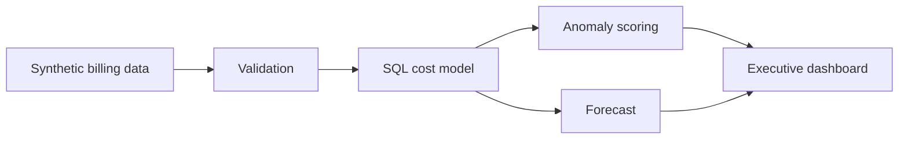

# Data Cost Guard

An end-to-end cost intelligence pipeline that identifies abnormal connector and warehouse spend, forecasts the next 30 days, and produces a decision-ready executive dashboard.

**[Open the live executive dashboard](https://pratyushdhakad.github.io/data-cost-guard/)**

> All records and results in this repository are synthetic. They demonstrate the engineering approach without exposing employer data.

## Why this project exists

Modern data teams can accumulate cost across ingestion connectors, warehouse workloads, and business owners faster than monthly invoices can explain it. Data Cost Guard answers four operational questions:

1. Where is platform spend concentrated?
2. Which daily costs are outside a connector's normal range?
3. How much excess cost should be reviewed?
4. What is the expected 30-day run rate?

## What it demonstrates

- Reproducible synthetic data generation
- Schema and business-rule validation
- SQL aggregation and cost-per-unit modeling
- Rolling robust anomaly detection
- Interpretable run-rate forecasting
- Automated static dashboard generation
- End-to-end tests and GitHub Actions CI

## AI-augmented build method

I use AI aggressively as engineering leverage: exploring approaches, accelerating implementation, generating edge cases, and tightening documentation. I remain accountable for the problem framing, architecture, business rules, evaluation criteria, test coverage, and every decision that reaches the repository.

The standard is simple: generated output is a draft until it runs, survives tests, and can be explained.

## Architecture



See [the architecture notes](docs/architecture.md) for design decisions and production extensions.

## Quick start

```bash
python3 -m venv .venv
source .venv/bin/activate
pip install -r requirements.txt
make test
make run
make serve
```

Then open `http://localhost:8000`.

The pipeline regenerates:

- `data/connector_costs.csv`
- `artifacts/daily_connector_cost.csv`
- `artifacts/anomalies.csv`
- `artifacts/summary.json`
- `dashboard/index.html`

## Detection method

Each connector is evaluated against its own trailing 28-day history. The anomaly score uses the rolling median and median absolute deviation rather than a global threshold, so naturally expensive connectors are not penalized simply for having a higher baseline.

```text
robust score = 0.6745 × (current cost − rolling median) / rolling MAD
```

Only prior observations are included in the baseline, preventing the current spike from weakening its own alert.

## Repository map

```text
src/data_cost_guard/   pipeline, validation, scoring, forecast, report
sql/                   portable daily cost model
tests/                 unit and end-to-end tests
dashboard/             generated executive dashboard
artifacts/             generated analysis outputs
docs/                  architecture and interview walkthrough
.github/workflows/     automated quality checks
```

## Decisions and limitations

- The forecast is a transparent short-horizon trend model. It prioritizes explainability over seasonal sophistication.
- An anomaly is a review signal, not proof of waste. A production workflow should capture owner feedback.
- Synthetic data contains deliberately injected spikes so detection behavior can be tested reliably.
- Production deployment would add cloud billing sources, orchestration, alert routing, access controls, and budget metadata.

## Interview guide

The [five-minute walkthrough](docs/interview-walkthrough.md) explains the business problem, technical choices, testing strategy, and production trade-offs.

## License

MIT
