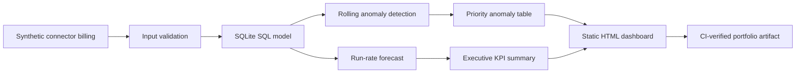

# Architecture

## Design decisions

- The source dataset is generated deterministically, so demonstrations and CI runs are reproducible.
- SQL owns aggregation and unit-cost modeling; Python owns statistical scoring and report generation.
- A rolling median and median absolute deviation reduce sensitivity to extreme cost spikes.
- The dashboard is a dependency-free static artifact and can be opened or hosted anywhere.
- All outputs are regenerated by one command, preventing undocumented manual adjustments.

## Production extensions

In a production environment, the CSV source could be replaced by billing exports from a warehouse and connector platform. Alert routing, budget ownership, authentication, orchestration, and historical backfills would be added without changing the decision model.
